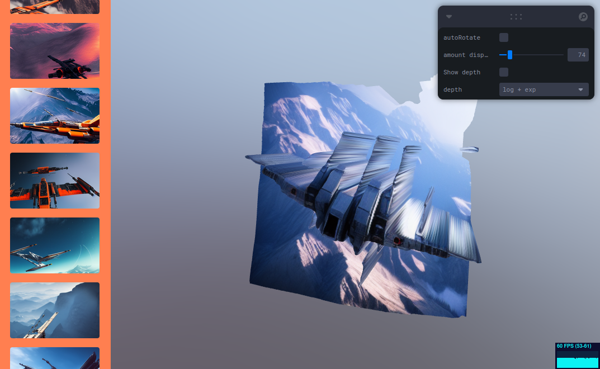

# WebGL depth map viewer

This is a WebGL experiment to visualize generated depth information of a few images
by displacing the pixels on the z axis.

It is visible online here: https://idlewan.github.io/depthmap_viewer/



Clicking and dragging on the canvas allows you to orbit and rotate around the
image mesh.

A couple of options on the top right allow you to vary the amount of displacement,
and what to do with the depth value (use as-is / linearly, or map it through
an exponential / logarithm function);

## Building

Install dependencies first (you need `tsc` (the typescript compiler),
`node` and `npm` on your machine):
```bash
$ npm i
```
Then run the build and development server:
```bash
$ npm run watch
```

You can now see the viewer in your browser at http://localhost:8080/.

## Inner workings

The viewer uses a rectangular mesh with as many vertices as there are pixels
in the images.
Each vertex is then displaced in the vertex shader by the amount of depth
given by an associated depth texture.

The color images are stored in `buidl/color/`, and an associated depth image
similarly-named should be placed in `build/depth` (the depth map generation
added "`-dpt_beit_large_512`" at the end of the filename, and for simplicity's
sake this was not changed). The image list is fetched
on application load, and is located at `build/color/list.txt`.

Regenerating the image list is as simple as writing `cd build/color ; ls -1 > list.txt`
in a terminal.

The viewer uses `stylus` for the CSS, a `.pug` template for the html document,
`React` for the side column listing the thumbnails, `react-three-fiber` and `three.js`
for the WebGL viewer. `leva` is used for the right-side options panel, and `drei`
for a few addons like the orbit controls and stats panel.

## Limitations

In the abscence of camera intrinsic parameters / information on the FOV,
this displaces all the vertices in the same direction (parallel to the Z axis).
The depth information used this way would only feel correct if the original
camera was an orthographic camera, so it's a shortcut/trick to use it this way.

An improvement that could be made would be to choose a viewing origin
(somewhat in front of the middle of the image), pass it to the vertex shader
doing the displacement, and displace the vertex towards that camera origin instead.
This would better reproject the depth information of the image, however it can
be argued that the generated depth map isn't very precise to begin with so
would not necessarily make much of a difference.

Another limitation is that currently the mesh used is of a fixed 512x512 size.
A potential improvement would be to get the image size, then modify the mesh so
that we keep having one vertex per pixel and a correct aspect ratio.
As-is, non-square images would still load but would display with the incorrect ratio.
If the image has bigger dimensions than 512 pixels side, it currently also doesn't
benefit from the added resolution because of the fixed size of the mesh.
As all of the sample images in this repository are 512 by 512, this didn't
feel like a critical thing to have, but is possible as a future imporovement.

A nice improvement would also be to show a file picker / drag-and-drop zone
(maybe on top of the left column) to accept any image file from the browser user
directly. This would help make the viewer more useful instead of having
to rely only on a server-side list of images. It would probably necessitate two
zones (one for color texture, the other for the depth texture). This wasn't
implemented because of time constraints.
